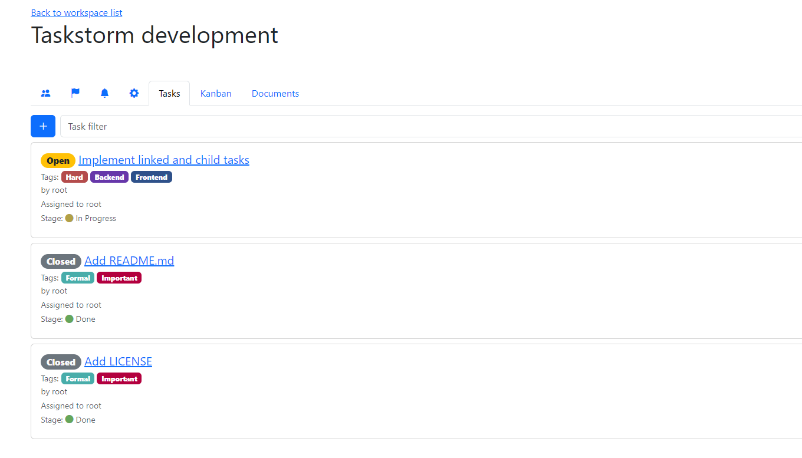
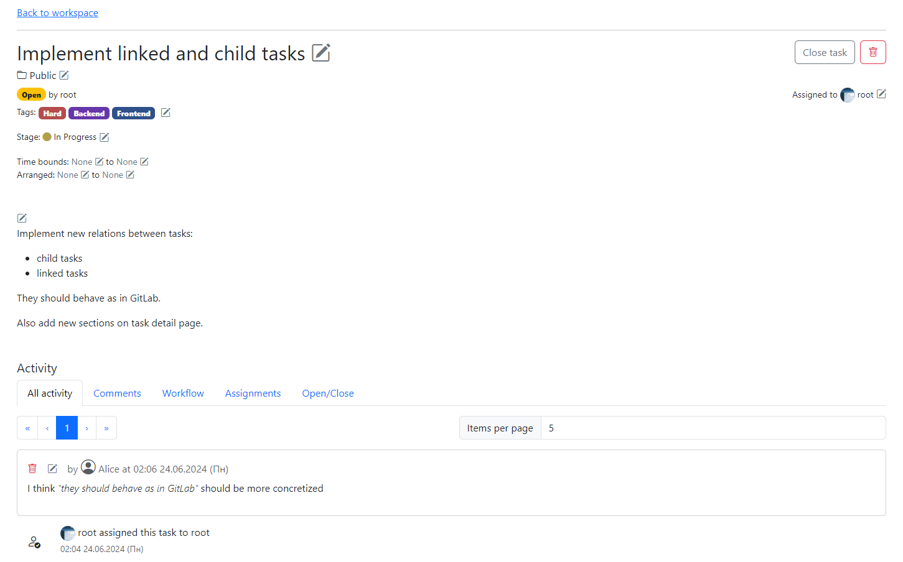
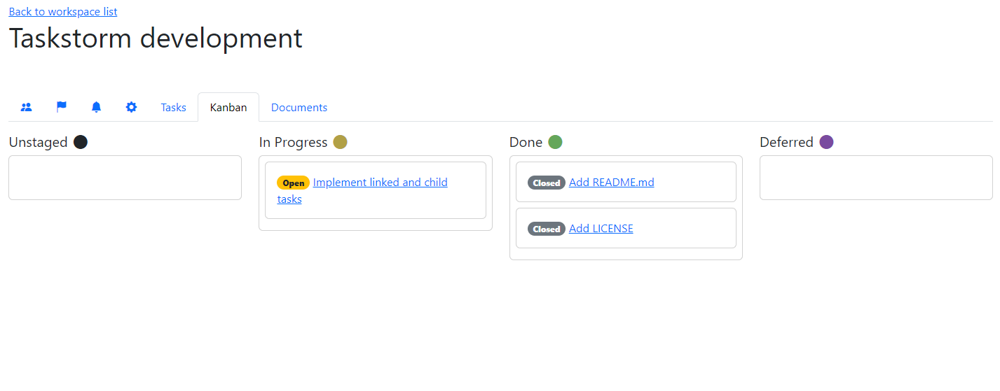
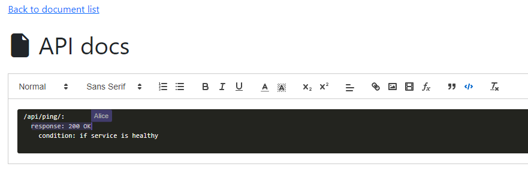
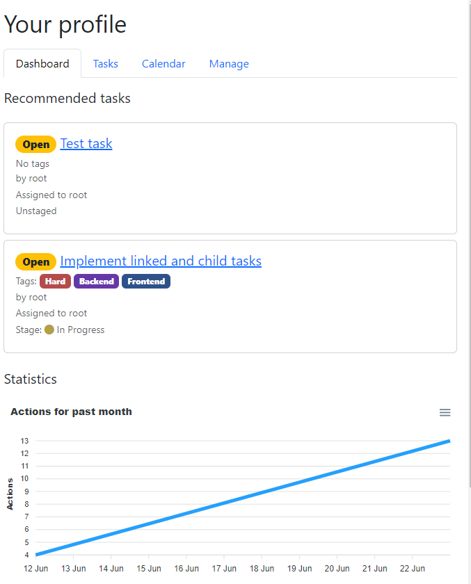

**Taskstorm** - A universal and collaborative task-tracker. 


<!-- TOC -->
  * [Features](#features)
    * [Upcoming:](#upcoming)
  * [Deploying](#deploying)
    * [Requirements](#requirements)
    * [Running](#running)
    * [Providing SSL certificate](#providing-ssl-certificate)
    * [Launching without SSL certificate (local only)](#launching-without-ssl-certificate-local-only)
  * [Docs](#docs)
  * [Tech stack](#tech-stack)
    * [Backend](#backend)
    * [Frontend](#frontend)
    * [Other](#other)
  * [Screenshots](#screenshots)
  * [Developer](#developer)
  * [License](#license)
<!-- TOC -->

## Features
- Workspace system to separate tasks for different projects
- Task tags and categories
- GitLab-style tag filtering for tasks
- Workflow stages to differentiate readiness statuses
- Customizing task list that should be notification targets
- Auto-closing tasks that are moved to stage that counts as
  finish
- Commenting tasks
- GitLab-style activity list in tasks
- GitHub-flavored Markdown in task descriptions and comments
- Kanban board
- Documents with live collaborative rich-text editing
- Calendar for user's tasks
- Statistics in profile
- Task recommendation

### Upcoming:
- [ ] Notification caching
- [ ] Linked and child tasks

## Deploying
### Requirements
- Docker (w/ Docker Compose)

### Running
Taskstorm is using Docker Compose for deployment, so 
you can just clone this repo and start containers:
```sh
git clone https://github.com/Tapeline/Taskstorm.git
cd Taskstorm
docker compose up -d
```
Except you should provide SSL certificate and then access web interface via standard 443
browser port.

Also do not forget to provide environment variables:
- `VAPID_PUBLIC` and `VAPID_PRIVATE` - VAPID keys. They are
  needed for webpush notifications to work properly.
- `SECRET_KEY` - API secret key (signing JWT, etc.)

### Providing SSL certificate
SSL certificate files should be placed in `~/sslcert/` 
directory. For example, using a LetsEncrypt cert:
```
~/
|- sslcert
   |- fullchain.pem
   |- privkey.pem
```
> **Attention!**
> Taskstorm is configured to use exactly these file names.
> If they differ, you can:
> 1. Rename them
> 2. Create a symbolic link with other name
> 3. Configure Nginx service in `docker-compose.yml` to
>    use different files

### Launching without SSL certificate (local only)

If you want to test Taskstorm on your machine, you might
not want to provide SSL cert. In this case, you can use
this command:
```shell
docker compose -f docker-compose.yml -f docker-compose.local.yml up -d
```

## Docs
[Link to docs](docs/index.md)

## Tech stack
### Backend


### Frontend


### Other


## Screenshots






## Developer
Project is being developed by [@Tapeline](https://www.github.com/Tapeline)

## License
This work is licensed under GNU General Public License v3.0
